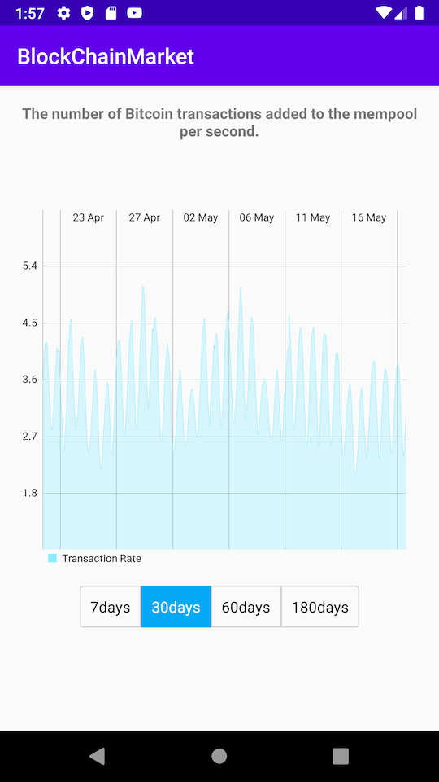

# BitsBytes
A multimodule Android app that fetches information about the current Bitcoin market price and then displays display the data in a graph.

## Architecture
The app uses the **Clean Code + MVVM** architectural pattern.

## Dependency Injection
Dependency Injection is managed using Dagger2

## Database
App uses the Room Database

## Static Analysis
App uses ktlint and detekt 

## Libraries
RxJava, Dagger2, Room, LiveData, ViewModel, MPAndroidChart e.t.c

## Tests
Unit tested the data, domain and presentation layers
